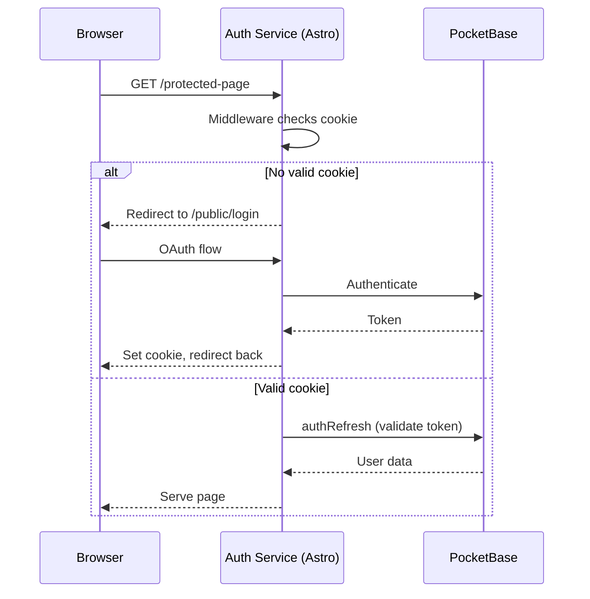

# PocketBase Auth

Protect any web application with PocketBase OAuth authentication. Copy the code, customize it, deploy it.

## How it works



Everything under `/public/` is accessible without authentication. Everything else requires a valid PocketBase session.

## Templates

### For existing Astro apps

Copy auth pages and middleware into your project:

```bash
npx giget gh:levino/pocketbase-auth/templates/astro-pages ./auth-temp
# Move files into your src/ directory
```

Files you get:
- `src/middleware.ts` - Auth check for all non-`/public/` routes
- `src/pages/public/login.astro` - OAuth login page
- `src/pages/public/access-denied.astro` - Shown when user is not in group
- `src/pages/public/auth/verify.ts` - ForwardAuth endpoint for Traefik/nginx/Caddy
- `src/pages/public/auth/cookie.ts` - Sets HTTP-only auth cookie
- `src/pages/public/auth/logout.ts` - Clears auth cookie

### For Docker / Coolify

Complete Astro app with Dockerfile, ready to add to your Docker Compose stack:

```bash
npx giget gh:levino/pocketbase-auth/templates/astro-docker apps/auth
```

## Demos

- [`demos/astro`](demos/astro) - Astro app deployed to Cloudflare Workers (with Terraform)
- [`demos/coolify-compose`](demos/coolify-compose) - Docker Compose with Traefik ForwardAuth protecting an nginx server

## Environment variables

| Variable | Required | Description |
|----------|----------|-------------|
| `POCKETBASE_URL` | Yes | PocketBase instance URL |
| `POCKETBASE_GROUP` | No | Group field name for access control. If not set, any authenticated user has access. |

## PocketBase setup

1. **users** collection with OAuth providers configured (GitHub, Google, Microsoft)
2. **groups** collection (only if using `POCKETBASE_GROUP`):
   - `user_id` (relation to users)
   - `[group_field]` (boolean)

## ForwardAuth

The `/public/auth/verify` endpoint is compatible with any reverse proxy that supports external auth:

| Reverse Proxy | Directive |
|---------------|-----------|
| Traefik | `forwardauth.address` |
| nginx | `auth_request` |
| Caddy | `forward_auth` |

Returns `200` with `X-Auth-User` and `X-Auth-Email` headers on success, `401` or `403` on failure.

## License

MIT
