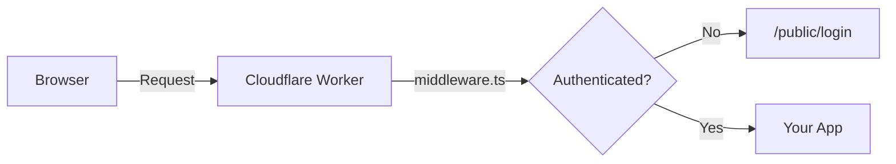

# Demo: Astro on Cloudflare Workers

Astro app with PocketBase auth deployed to Cloudflare Workers.



## Structure

Auth pages are symlinked from `templates/astro-pages`. Edit them there or break the symlink and customize locally.

## Setup

1. Install dependencies:
   ```bash
   npm install
   ```

2. Set PocketBase URL in `wrangler.toml`:
   ```toml
   [vars]
   POCKETBASE_URL = "https://your-pocketbase.example.com"
   ```

3. Run locally:
   ```bash
   npm run dev
   ```

4. Deploy:
   ```bash
   npm run deploy
   ```

## Terraform

See `terraform/` for deploying to Cloudflare Pages with VCS integration.
