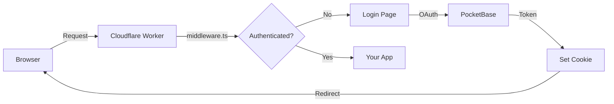

# Demo: Astro on Cloudflare Workers

Astro app with PocketBase auth deployed to Cloudflare Workers.

## Architecture



## Structure

```
src/
├── middleware.ts            → symlink to templates/astro-pages
├── env.d.ts                → symlink to templates/astro-pages
└── pages/
    ├── index.astro         ← your app (edit this)
    ├── login.astro         → symlink to templates/astro-pages
    ├── access-denied.astro → symlink to templates/astro-pages
    └── auth/               → symlink to templates/astro-pages
        ├── verify.ts
        ├── cookie.ts
        └── logout.ts
```

Auth pages are symlinked from `templates/astro-pages`. Edit them there or break the symlink and customize locally.

## Setup

1. Install dependencies:
   ```bash
   npm install
   ```

2. Set your PocketBase URL in `wrangler.toml`:
   ```toml
   [vars]
   POCKETBASE_URL = "https://your-pocketbase.example.com"
   POCKETBASE_GROUP = "members"
   ```

3. Run locally:
   ```bash
   npm run dev
   ```

4. Deploy to Cloudflare:
   ```bash
   npm run deploy
   ```

## Customization

- Edit `src/pages/index.astro` for your app content
- To customize auth pages: delete the symlink, copy the file, edit it
