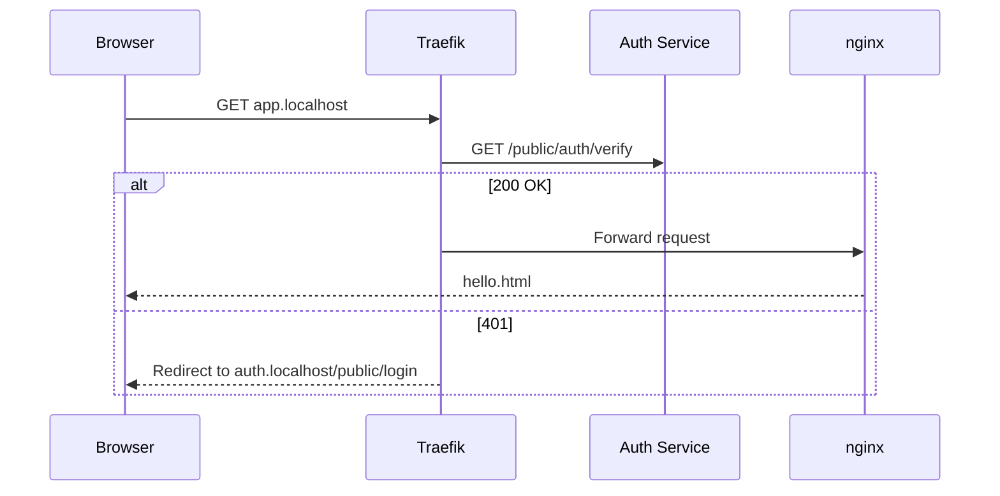

# Demo: Docker Compose with Traefik ForwardAuth

Protects an nginx hello-world server with PocketBase auth.



## Setup

1. Edit `docker-compose.yml` - set `POCKETBASE_URL`
2. Customize auth pages in `auth/src/pages/public/`
3. Run:
   ```bash
   docker compose up
   ```
4. Open:
   - http://app.localhost - Protected hello world
   - http://auth.localhost/public/login - Login page

## Adapt

Replace the `hello` service with your actual app:

```yaml
  my-app:
    image: my-app:latest
    labels:
      - "traefik.enable=true"
      - "traefik.http.routers.my-app.rule=Host(`my-app.localhost`)"
      - "traefik.http.routers.my-app.middlewares=pb-auth@docker"
      - "traefik.http.services.my-app.loadbalancer.server.port=8080"
```
