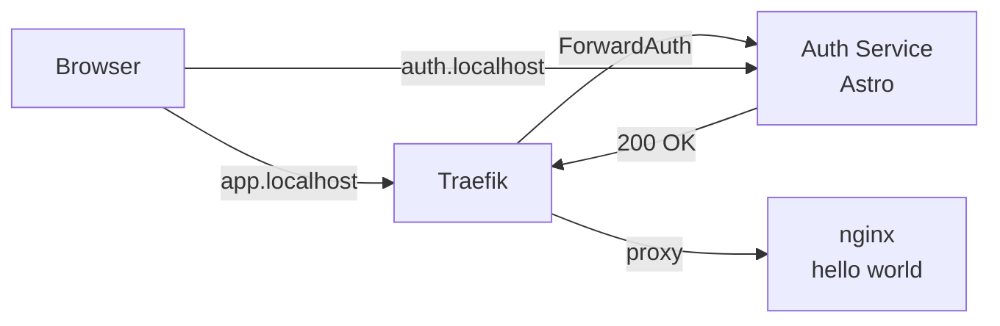
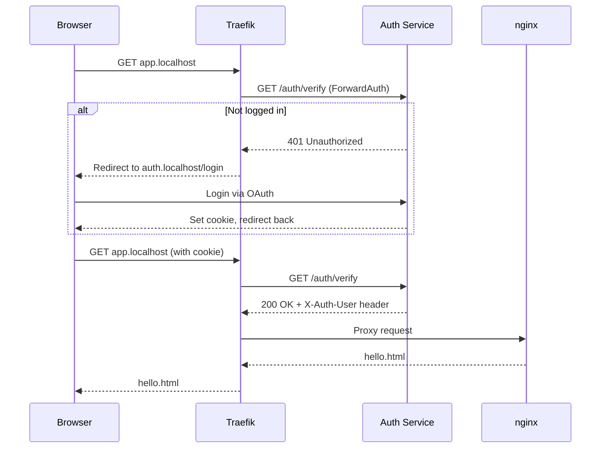

# Demo: Coolify / Docker Compose

Protects an nginx hello-world server with PocketBase auth using Traefik ForwardAuth.

## Architecture



## Setup

1. Edit `docker-compose.yml` and set your `POCKETBASE_URL` and `POCKETBASE_GROUP`

2. Customize the auth pages in `auth/src/pages/` (login, access-denied, etc.)

3. Run:
   ```bash
   docker compose up
   ```

4. Open:
   - http://app.localhost - Protected hello world (requires login)
   - http://auth.localhost - Auth service (login page)

## How it works



## Adapt for your use case

Replace `hello` service with your actual service (Fava, Grafana, any web app):

```yaml
  my-app:
    image: my-app:latest
    labels:
      - "traefik.enable=true"
      - "traefik.http.routers.my-app.rule=Host(`my-app.localhost`)"
      - "traefik.http.routers.my-app.middlewares=pb-auth@docker"
      - "traefik.http.services.my-app.loadbalancer.server.port=8080"
```
